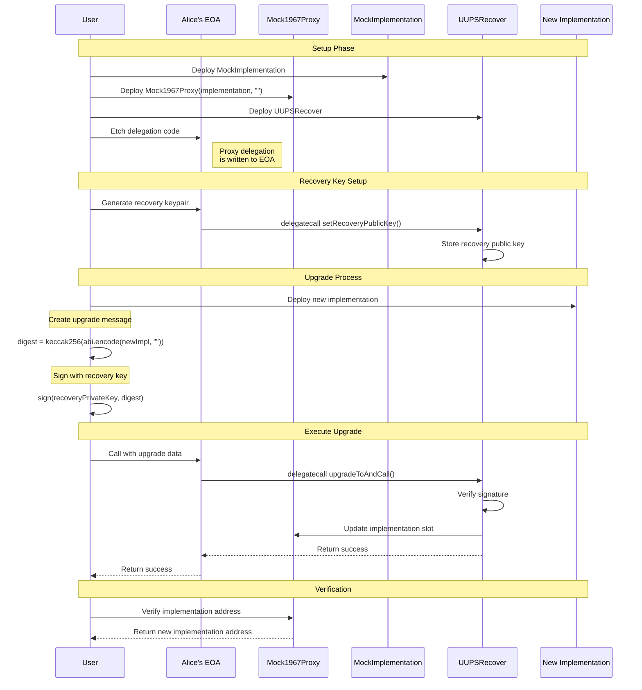

## UUPSRecover

A singleton contract that enables signature-based recovery of ERC1967 proxies. This contract provides an alternative upgrade mechanism for UUPS proxies through cryptographic signatures.

## Overview

UUPSRecover is designed to be used alongside UUPS upgradeable contracts to provide an additional recovery path through a dedicated recovery key. The contract follows OpenZeppelin's UUPS implementation patterns while adding signature-based authorization.

Key features:
- Signature-based upgrade authorization
- Dedicated recovery public key per proxy
- Compatible with ERC1967 and UUPS proxy patterns
- Minimal storage footprint using singleton pattern
- Security checks for UUPS compliance

## Architecture

The contract uses:
- ERC1967 storage slots for implementation addresses
- Custom storage slot for recovery keys
- ECDSA signatures for authorization
- Delegate call pattern for upgrades

## Flow Diagram

The following sequence diagram shows the end-to-end flow for a signature-based upgrade:



## Usage

### Deployment

1. Deploy the UUPSRecover singleton contract once
2. Each proxy can then delegate call to it for recovery functionality

### Setting Recovery Key

To set or update the recovery key:

```solidity
bytes memory data = abi.encode(
    address(recover),
    abi.encodeWithSelector(UUPSRecover.setRecoveryPublicKey.selector, newRecoveryKey)
);
(bool success,) = address(this).delegatecall(data);
```

## Security Considerations

- The recovery key has full upgrade authority - it should be stored securely and used only for recovery
- The contract includes standard UUPS security checks to prevent:
  - Upgrades to non-UUPS compliant implementations 
  - Unauthorized upgrades
  - Delegate call requirements
- All upgrade operations require valid signatures from the designated recovery key
- The contract follows OpenZeppelin's standard implementation slot for UUPS proxies

## References

- [ERC-1967: Proxy Storage Slots](https://eips.ethereum.org/EIPS/eip-1967)
- [ERC-1822: Universal Upgradeable Proxy Standard (UUPS)](https://eips.ethereum.org/EIPS/eip-1822)
- [OpenZeppelin UUPS Documentation](https://docs.openzeppelin.com/contracts/api/proxy#UUPSUpgradeable)

## License

MIT License

## Security

This is experimental software and comes with no guarantees. Use at your own risk.
